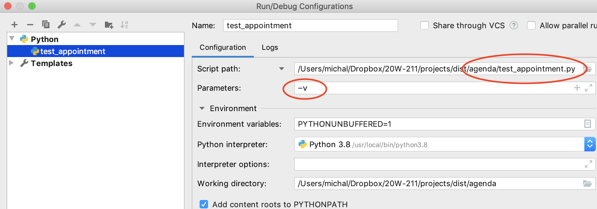
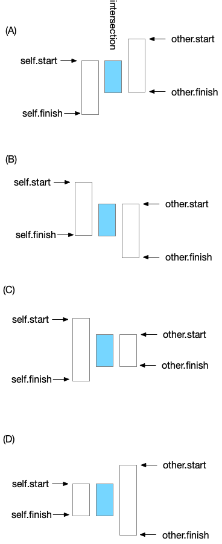
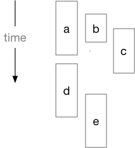
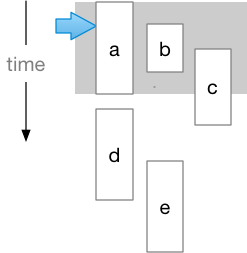
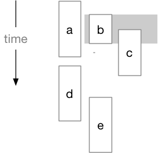

# HOWTO complete the Appointments project

You will create a source file called `appt.py` 
that defines two Python classes, 
`Appt` for a single appointment and `Agenda`
for a list of appointments. 
`appt_io.py` (provided) handles conversion 
to and from text files, and two unit test files 
`test_appt.py` and `test_agenda.py` provide 
a simple suite of test cases to check your 
progress on the `Appt` and `Agenda` classes, 
respectively, as you work through the project. 

Although you will build appt.py from scratch, 
many parts are provided for you in the instructions 
below.

## Skeleton of appt.py

Start by creating a docstring for the file. 
Indicate your name and briefly describe what 
this Python source file provides (which is the classes 
`Appt` and `Agenda`).

`Appt` objects will record the dates and times 
that appointments begin and end using a 
Python class called `datetime`, so import 
the `datetime` class from the `datetime` module 
like this: 

```python
from datetime import datetime
```

At the end of the file,  create the code to 
be run if this program is executed as the 
main Python program. It should look like this:

```python
if __name__ == "__main__":
    print("Running usage examples") 
```

This code doesn't do anything useful yet, but 
let's execute the test suite anyway. Execute test\_appt.py in PyCharm, or at the command line, like this:

`$ python3 test_appt.py` 

The output should look somethine like this:

```text
Traceback (most recent call last):
  File "test_appt.py", line 3, in <module>
    from appt_io import parse_appt, parse_agenda, read_agenda
  File "/Users/michal/Dropbox/20W-211/projects/dist/agenda/appt_io.py", line 13, in <module>
    def parse_appt(appt_text: str) -> appt.Appt:
AttributeError: module 'appt' has no attribute 'Appt'
```

The test suite is trying to use class `Appt`, and we haven't created class `Appt` yet. 
Let's fix that. Introduce it like this (just after 
the file docstring):

```python
class Appt:
    """An appointment has a start time, an end time, and a title.
    The start and end time should be on the same day.
    Usage example:
        appt1 = Appt(datetime(2018, 3, 15, 13, 30), datetime(2018, 3, 15, 15, 30), "Early afternoon nap")
        appt2 = Appt(datetime(2018, 3, 15, 15, 00), datetime(2018, 3, 15, 16, 00), "Coffee break")
        if appt2 > appt1:
            print(f"appt1 '{appt1}' was over when appt2 '{appt2}'  started")
        elif appt1.overlaps(appt2):
            print("Oh no, a conflict in the schedule!")
            print(appt1.intersect(appt2))
    Should print:
        Oh no, a conflict in the schedule!
        2018-03-15 15:00 15:30 | Early afternoon nap and Coffee break
    """
```

At this point the Appt class doesn't actually do anything, 
but perhaps we can at least get past the first failure 
in the test suite. We'll run the test suite again, and 
this time the output will look something like this:

```
Traceback (most recent call last):
  File "/Users/michal/Dropbox/19W-211/projects/appointments/test_appointment.py", line 3, in from appt_io import parse_appt, parse_agenda, read_agenda
  File "/Users/michal/Dropbox/19W-211/projects/appointments/appt_io.py", line 38, in def read_agenda(file: Iterable[str]) -> appt.Agenda:
AttributeError: module 'appt' has no attribute 'Agenda' 
```

OK, same problem, we need a class Agenda. We'll just create a dummy one for now:

```python
class Agenda:
    """FIXME in a bit"""
``` 

Now if we execute the test suite, we get a 
long list of errors. Progress!

## Building the Appt class

We'll ignore the tests of the Agenda class for 
now and focus on completing the Appt class. 
In the test suite we can see that TestAppt 
is usng a function in `appt\_io.py` to create an 
`Appt` object from a string. The function in 
`appt\_io` in turn calls the constructor of 
`Appt`, which is the class we need to write. 
The call in `parse\_appt` uses some functions 
that are probably unfamiliar to build the 
arguments to the constructor, but we don't need 
to puzzle that out; we can see from the call

 `appt.Appt(period_start, period_finish, desc)` 

and from the example in the usage example

`appt1 = Appt(datetime(2018, 3, 15, 13, 30), datetime(2018, 3, 15, 15, 30), "Early afternoon nap")` 

that the constructor should take two datetime objects and a string.

datetime objects are defined in a Python library module, so before we can make use of them, we need to _import_ that module into appt.py. The import statement comes after the file's main docstring and before other code. We want to import the datetime class from datetime.py. The from form of import allows us to do that and then refer to the class datetime in the rest of the file without qualifying it as datetime.datetime:

`from datetime import datetime` 

Since this module will use datetime objects throughout, 
you should spend a few minutes reading documentation for 
that class. 
If [https://docs.python.org/3/library/index.html](https://docs.python.org/3/library/index.html) 
isn't already bookmarked in your browser, it should be. 
Search for _datetime_ and follow the link.

Now we can create the constructor method and 
specify that two of its arguments should be 
datetime objects. The constructor method 
(which is always called `__init__` in Python) 
should look like this:

```python
    def __init__(self, start: datetime, finish: datetime, desc: str):
        """An appointment from start time to finish time, with description desc.
        Start and finish should be the same day.
        """
        assert finish > start, f"Period finish ({finish}) must be after start ({start})"
        self.start = start
        self.finish = finish
        self.desc = desc
```

Note the assertion at the beginning of the constructor: 
The program will (intentionally) crash if we try to create 
an appointment that takes zero time or that ends before it 
starts. This is called a _precondition_ check. 
The `Appt` constructor checks its precondition 
and crashes immediately, 
in a predictable way, if it is violated. 
This is much better than silently accepting bad 
data and then crashing or giving erroneous results 
later in some unpredictable manner.

How is that comparison `finish > start` working? 
How does Python know how to compare two datetime 
objects? It's magic! No, really. It uses a trick 
called “magic methods” Officially they are called 
“special methods”, but everyone calls them 
“magic methods”. 

When you write an expression like `x < y`, 
Python interprets it as a call on a method 
like `__lt__` (less than). 
This is the case even for the built-in classes 
like `int` and `str`. Don't believe me? 
Try this in a Python console:

```
>>> (5).__lt__(3)
False
>>> (3).__lt__(5)
True
>>> "squid".__gt__("octopus")
True
```

The last result above is not because pythons, 
being long skinny creatures themselves,  
like squids better 
than octopods.  It is because `s` comes after 
`o` in the alphabet. 

The datetime class has defined methods for 
comparing datetime objects. We need to do the 
same thing for Appt objects. In the test suite 
in `test_appts.py`, we can see that test case 
`test_00_equality` and `test_01_order` compare 
appointments using
 `==`, `<` and `>`. 

```python
    def test_00_equality(self):
        self.assertTrue(self.brunch == self.brunch)
        self.assertTrue(self.coffee == self.coffee_same)
        self.assertTrue(self.coffee != self.brunch)

    def test_01_order(self):
        self.assertTrue(self.coffee < self.more_coffee)
        self.assertFalse(self.coffee > self.more_coffee)
        self.assertTrue(self.more_coffee > self.coffee)
        self.assertFalse(self.more_coffee < self.coffee)
        self.assertTrue(self.last_year < self.brunch)
        self.assertTrue(self.brunch < self.next_month)
        self.assertTrue(self.naptime > self.more_coffee)` 
```

For appointments, we want `<` to mean “before” 
and `>` to mean “after”. One appointment is 
after another if it has ended when the other 
starts. For example, if I have a meeting from 
10am to 11am, and class beginning 11am, then 
my meeting is before my class. But if my meeting
is from 10am to 11:30am, and class starts at 
11am, then my meeting is not _before_ my class 
even though it starts earlier. If two appointments 
overlap, we will say that neither one is before 
(<) the other.

For appointments, the operations you need are:

* `<` : 
“before”. Appointment _a_ is before appointment _b_ iff the finish time of _a_ is equal or earlier than the start time of _b_. Magic method name is \_\_lt\_\_ ,

* `>` : 
“after”. Appointment _a_ is after appointment _b_ iff the start time of _a_ is equal or after the finish time of _b_. Magic method name is \_\_gt\_\_ .

* `==` : 
“equal”. We say that two appointments are equal if they have the same start and end times, _even if they have different titles._ Magic method name is \_\_eq\_\_ .

* `!=` : 
“not equal”. You do not need to implement a magic method for !=. Python calls the the \_\_eq\_\_ method and negates the result.

Here is an implementation of `__eq__`:

```python
    def __eq__(self, other: 'Appt') -> bool:
            """Equality means same time period, ignoring description"""
            return self.start == other.start and self.finish == other.finish
```

You need to write similar implementations for `__lt__` and 
`__gt__`. When you have added these methods to 
the `Appt` class, 
two of the test cases in `test_appt.py` 
should pass:

```
..EE
[ ... details elided ... ]
------------------------
Ran 4 tests in 0.003s

FAILED (errors=2)
```

Tests `test_00_equality` and `test_01_order` 
should now be passing. 
Tests `test_02_overlap` and `test_03_intersect` 
check methods we have not yet implemented.
If we set up a PyCharm configuraton with the -v 
option, 



we can see a list of the passing and failing 
test cases before details of the (many) errors: 

``` 
/usr/local/bin/python3.8 /Users/michal/Dropbox/20W-211/projects/dist/agenda/test_appt.py -v
test_00_equality (__main__.TestAppt) ... ok
test_01_order (__main__.TestAppt) ... ok
test_02_overlap (__main__.TestAppt) ... ERROR
test_03_intersect (__main__.TestAppt) ... ERROR
```

### Checking for overlapping appointments

Our ultimate goal is to check for conflicting 
appointments. For example, if we have scheduled 
a lunch meeting from noon to 1:30pm, and scheduled 
another meeting from 1pm to 2pm, then there is a 
conflict in our schedule because those appointments
 overlap in time. You must implement a method 
 overlap to determine whether two appointments 
 overlap in time, and a method intersect to 
 determine the period period of overlap. These methods 
 must not alter the appointments being compared.

The header of method overlap in class `Appt` should 
look like this:

```
    def overlaps(self, other: 'Appt') -> bool:
        """Is there a non-zero overlap between these periods?"""
```

Note that you have already implemented methods 
to determine whether an appointment 
_a_ is over when appointment _b_ starts 
(a < b) or vice versa (a > b). 
You should make use of these rather 
than coding the same logic again. This is called 
the _DRY_ principle: Don't Repeat Yourself.

You must also create method `intersect` for 
determining the period of overlap between two 
appointments. `self.overlaps(other)` is a 
_precondition_ of `intersect` and must be tested 
at the beginning of the method, like this: 

```python
    def intersect(self, other: 'Appt') -> 'Appt':
        """The overlapping portion of two Appt objects"""
        assert self.overlaps(other)  # Precondition
```

The result of 
method `intersect` should be a new `Appt` object. 
The usage example in the docstring for class 
`Appt` illustrates how the description of the new 
appointment should be formed from the descriptions 
of the two overlapping appointments.

When designing a method like `intersect`, it 
helps to draw pictures.  We can identify four 
different relations among start and end times of 
two appointments (or more if we consider equality): 



While we can identify these four cases, 
we do *not* want to write different code 
for each case.  We want to write one simple
piece of code that works for all four.  (Hint: 
the `min` and `max` functions work for any 
objects that have `<` and `>` operations,  
including `datetime` objects.)

When you have successfully implemented `overlaps` 
and `intersect`, test cases `test_02_overlap`
and `test_03_intersect` should pass. 

```
test_00_equality (__main__.TestAppt) ... ok
test_01_order (__main__.TestAppt) ... ok
test_02_overlap (__main__.TestAppt) ... ok
test_03_intersect (__main__.TestAppt) ... ok

----------------------------------------------------------------------
Ran 4 tests in 0.003s

OK
``` 

### Formatting appointments

At this point we are passing all the tests 
for class `Appt`, but there is one last thing 
to take care of before moving on to class 
`Agenda`. If we print an appointment, 
it doesn't look very nice:

```
>>> from appt import Appt
>>> from datetime import datetime
>>> ap = Appt(datetime(2018, 3, 15, 15, 00), datetime(2018, 3, 15, 16, 00), "Coffee break")
>>>print(ap)
<appt.Appt object at 0x10cc1e4e0>
``` 

This default formatting does not cause any of 
our test cases to fail yet, but it will cause 
problems later when we are reading and writing 
agenda files, and it is clearly not very useful.
A user of our scheduling software is more likely
to care that coffee break begins at 3:00pm than 
that it is stored in an object at memory 
address 0x10cc1e4e0. Let's fix it now.

Some of the built in functions in Python also 
invoke magic methods. The `str` function is one 
of these. The `print` function calls the `str` 
function on each variable it prints, 
and `str(x)` in turn calls magic method 
`x.__str__()`. Therefore we need to provide a 
`__str__` method for class `Appt`.

We want the output format of an appointment to be the same as the input format. The [xkcd strip](https://xkcd.com) reminds us that there is a right way to do this:


Fortunately the datetime class provides methods 
for producing this format. To save you some time 
reading the documentation for datetime and 
experimenting with the formatting methods, a 
definition for the `__str__` method of `Appt` 
is provided for you here:

```
    def __str__(self) -> str:
        """The textual format of an appointment is
        yyyy-mm-dd hh:mm hh:mm  | description
        Note that this is accurate only if start and finish
        are on the same day.
        """
        date_iso = self.start.date().isoformat()
        start_iso = self.start.time().isoformat(timespec='minutes')
        finish_iso = self.finish.time().isoformat(timespec='minutes')
        return f"{date_iso} {start_iso} {finish_iso} | {self.desc}" 
```

This will be fine for printing, but the debugger 
and the Python console use a different formatting
method.  Instead of `str(appt)`, the console and 
debugger call
`repr(appt)`.  The idea is that `repr` should 
produce a string representation that is useful in 
debugging, which might be different from the 
representation we want to provide to users.  
The default `repr` function isn't very useful: 

```
>>> import appt
>>> from datetime import datetime
>>> ap = appt.Appt(datetime(2019,12,31,11,30), datetime(2020,1,1,1,0), "Party like it's 1999")
>>> ap
<appt.Appt object at 0x10dddafd0>
```

Just like we defined a `__str__` method to 
provide a `str` method, we can define a 
`__repr__` method to control formatting by 
the `repr` function.  Whenever practical, we 
make the string produced by `repr` look like a 
call to the constructor.  Thus: 

```python
    def __repr__(self) -> str:
        return f"Appt({repr(self.start)}, {repr(self.finish)}, {repr(self.desc)})"
```

Now it is more convenient to use the console or the 
debugger: 

```
>>> import appt
>>> from datetime import datetime
>>> ap = appt.Appt(datetime(2019,12,31,11,30), datetime(2020,1,1,1,0), "Party like it's 1999")
>>> ap
Appt(datetime.datetime(2019, 12, 31, 11, 30), datetime.datetime(2020, 1, 1, 1, 0), "Party like it's 1999")
```

### Usage example in main program 

Recall that we have left a sort of promise 
at the end of the file: 

```python
if __name__ == "__main__":
    print("Running usage examples")
```

It's time to fulfill that promise with an 
example of the code we have written so far. 
We'll just copy it from the usage example 
in the docstring of the `Appt` class.  Now, 
when we run `appt.py`, we will see that the 
output is what we expected: 

```
$ python3 appt.py
Running usage examples
Oh no, a conflict in the schedule!
2018-03-15 15:00 15:30 | Early afternoon nap & Coffee break
```

## The Agenda class

An `Agenda` is a collection of `Appt` objects. 
For this project, we will use a Python list 
to represent the `Appt` objects.  The constructor
will initialize an empty collection.  

```python
class Agenda:
    """An Agenda is a collection of appointments, 
    similar to a list. 

    Usage:
    appt1 = Appt(datetime(2018, 3, 15, 13, 30), datetime(2018, 3, 15, 15, 30), "Early afternoon nap")
    appt2 = Appt(datetime(2018, 3, 15, 15, 00), datetime(2018, 3, 15, 16, 00), "Coffee break")
    agenda = Agenda()
    agenda.append(appt1)
    agenda.append(appt2)
    ag_conflicts = agenda.conflicts()
    if len(ag_conflicts) == 0:
        print(f"Agenda has no conflicts")
    else:
        print(f"In agenda:\n{agenda.text()}")
        print(f"Conflicts:\n {ag_conflicts}")

    Expected output:
    In agenda:
    2018-03-15 13:30 15:30 | Early afternoon nap
    2018-03-15 15:00 16:00 | Coffee break
    Conflicts:
    2018-03-15 15:00 15:30 | Early afternoon nap and Coffee break
    """
    def __init__(self):
        self.elements = [ ]
```

### Delegation: `append`, `len` (`__len__`), and `==` (`__eq__`)

Developers often refer to a collection class like 
`Agenda` as a *wrapper* for the collection 
it contains, i.e., an `Agenda` *wraps* a 
`list` of `Appt` objects.  When we *wrap* 
a collection, we often provide methods that 
*delegate* to the methods of the wrapped 
class.   For example, the magic method 
`__eq__`, invoked by `==`, should delegate 
to the `__eq__` method of the wrapped `list`: 

```python
    def __eq__(self, other: 'Agenda') -> bool:
        """Delegate to __eq__ (==) of wrapped lists"""
        return self.elements == other.elements
```

The `len` function similarly calls the `__len__` magic
method, so you should write a `__len__` method 
for `Agenda` that delegates to the `__len__`
method of the list, as well as an `append`
method that delegates to the `append` method of 
the `list`. 

### Formatting an `Agenda`: `str` and `repr` (`__str__` and `__repr__`)

We will need a method to format an `Agenda` object, 
preferably the same as we expect to find input
files.  

```python
    def __str__(self):
        """Each Appt on its own line"""
        lines = [ str(e) for e in self.elements ]
        return "\n".join(lines)
```

Since the constructor of class `Agenda` only 
creates an empty `Agenda` object, a good 
debugging representation will not look like a 
correct call to the constructor.  It's more 
important to make it useful. 

```python
    def __repr__(self) -> str:
        """The constructor does not actually work this way"""
        return f"Agenda({self.elements})"
```

The other important method we need is one 
to produce a list of conflicts. If 
If the list of conflicts is wrapped in another 
`Agenda` object, then the `len` method of `Agenda`
suffices for distinguishing whether or not an 
agenda is free of conflict. So, all we really 
need to do is produce an 
Agenda object with the conflicts (overlapping 
appointments). It's signature should look like 
this:

```python
 def conflicts(self) -> 'Agenda':
        """Returns an agenda consisting of the conflicts
        (overlaps) between appointments in this agenda.
        """
```

We already have overlaps method and an 
intersect method in class Appt. It seems like 
we could simply loop through the items in the 
`Agenda`, comparing each element to every other 
element. However, recall this point in the 
required behavior section of the assignment:

*Your algorithm must run in time O(n lg n) 
 where n is max(number of appointments, number 
 of conflicts).*

Consider the simple algorithm that uses nested 
loops to compare each element to every other 
element. If there 1000 appointments, the first 
must be compared to 999 other appointments, 
the second must be compared to 998 other 
appointments, and so on. The total running 
time would be O(n^2) where n is the number of 
appointments. We must do better.

The requirement for time O(n lg n) (called log-linear time) is a hint of a better method. That just happens to be the efficiency of the best comparison-based sorting methods. It is, in particular, the efficiency of the sort method of the Python list class. Also, this sort method is even faster for lists that are already in order. In that case it runs in time O(n), where n is the length of the list. This means there is little penalty for sorting a list that is already sorted.

We can make the conflict-finding method much more efficient if we start by putting the Appt objects in order by start time. But this will be a _side effect_ of the conflicts method, so we'd better note that in the docstring:

```python
def conflicts(self) -> 'Agenda':
        """Returns an agenda consisting of the conflicts
        (overlaps) between this agenda and the other.
        Side effect: This agenda is sorted
        """
```

Sorting an `Agenda` just requires sorting the list 
of `Appt` objects in the `Agenda`.  The `sort` 
method for the `list` class normally uses the 
`<` comparison (i.e., the `__lt__` magic method)
to determine the order of elements.  We have 
defined a `__lt__` method for `Appt` objects, 
but there is a problem:  If two `Appt` objects 
*A1* and *A2* overlap in time, neither *A1* < *A2* 
nor *A1* > *A2*. So just calling `self.elements.sort()`
will not give us what we want.  We could fix this 
problem by changing the `__lt__` method in `Appt`, 
but then we would just make a problem for `Appt.overlaps`
instead.  

The fix to this problem is easy:  Instead of sorting 
by the order of `Appt` objects (which is undefined 
for overlapping appointments), we will sort by their
start time.  The `sort` method of class `list` 
has an optional argument that lets us extract a 
*sort key* from an element.  We want to extract 
the start time. 

## Aside: Tidying up with *lambda* 

We could write a very simple function for extracting 
the start time from an `Appt` object: 

```python
def start_time(appt: Appt) -> datetime: 
    return appt.start
``` 
Then we could define the `sort` method of `Agenda`
like this: 

```python
    def sort(self):
        """Sort agenda by appointment start times"""
        self.elements.sort(key=start_time)
```

That works, but it is cumbersome to define 
the `start_time` function for just this one 
use, and it makes reading the code more difficult
that it should be.  The `start_time` function is 
so simple that it would be nicer if we could 
just define it on-the-fly when we use it, 
without even bothering to give it a name. 
That is what *lambda* is for: 

```python
    def sort(self):
        """Sort agenda by appointment start times"""
        self.elements.sort(key=lambda appt: appt.start)
```

Concise! We would not use a *lambda* expression for 
a complicated function, and we cannot use it for a 
function that requires more than one line of code.  
For a trivial function like `start_time`,
*lambda* sparks joy. 

## Finding conflicts 

Now that we can sort appointments in an agenda 
by time, how can we make use of that to find all 
the conflicts in log-linear time? 
Drawing some pictures will help us reason 
about the algorithm. Suppose we have appointments 
_a_..._e_ with start and finish times as shown 
here:



These appear in the Agenda object in order _a, b, c, d, e_, that is, in order of their start times (because we sorted them in that order). Now consider which appointments _a_ must be compared with.



We must compare _a_ with _b_ and then with each subsequent appointment until we reach _d_. When we reach _d_ and notice that _d_ starts _after a is finished_, we do not have to look farther. Any Appt object that appears after _e_ in the sorted sequence must also start after _a_ has finished.

Next consider the set of appointments we must compare _b_ with. We do not need to consider _a_ again, because we have already found that conflict. We must consider the appointments that appear _after_ _b_ in the sorted list, but only until we find one that starts after _b_ has finished.



From this we can see that we can search for conflicts with nested loops, cutting the inner loop short with a break statement. The outer _for_ loop iterates through all the appointments in the Agenda list. The inner _for_ loop starts at the item just after the current appointment. It could continue to the end of the sequence, if all the appointments overlapped, but it can be cut off as soon as we encounter an appointment that starts after the appointment selected by the outer loop.

If you think carefully about this algorithm, 
you will see that the worst case running time 
is proportional to the number of appointments 
plus the number of conflicts. This satisfies 
our performance requirement. It should easily 
pass the timing test `test_1_fast`
in `test_agenda.py`:

```python
  def test_1_fast(self):
        """A linear time algorithm should be able to test
        an agenda with 5000 elements in well under a second,
        even on a fairly slow computer.
        """
        time_before = time.perf_counter()
        self.assertTrue(self.big.unconflicted())
        time_after = time.perf_counter()
        elapsed_seconds = time_after - time_before
        self.assertLess(elapsed_seconds, 2, "Are you sure your algorithm is linear time?")
        log.debug(f"Checked {len(self.big)} entries in {elapsed_seconds} seconds")` 
```

When you have provided a correct `conflicts` 
method, along with `sort` and `__str__`, 
the test cases in `test_agenda.py`
should pass: 
 
```
test_0_conflict (__main__.TestAgendaConflicts)
A small agenda that does have a conflict ... ok
test_1_fast (__main__.TestAgendaConflicts)
A linear time algorithm should be able to test ... DEBUG:__main__:Checked 5000 entries in 0.005885666999999983 seconds
ok
test_2_conflicts (__main__.TestAgendaConflicts)
Like thousand.txt but with a couple of conflicts ... DEBUG:__main__:Checked 1002 entries in 0.0008955880000000027 seconds
ok
test01_inout (__main__.TestAgendaInOut) ... ok
test02_sorting (__main__.TestAgendaInOut) ... ok

----------------------------------------------------------------------
Ran 5 tests in 0.349s

OK
```

As we did for the `Appt` class, we can now 
add the usage example for the `Agenda` class to 
the code that runs when `appt.py` is executed 
by itself: 

```python
if __name__ == "__main__":
    print("Running usage examples")
    appt1 = Appt(datetime(2018, 3, 15, 13, 30), datetime(2018, 3, 15, 15, 30), "Early afternoon nap")
    appt2 = Appt(datetime(2018, 3, 15, 15, 00), datetime(2018, 3, 15, 16, 00), "Coffee break")
    if appt2 > appt1:
        print(f"appt1 '{appt1}' was over when appt2 '{appt2}'  started")
    elif appt1.overlaps(appt2):
        print("Oh no, a conflict in the schedule!")
        print(appt1.intersect(appt2))
    agenda = Agenda()
    agenda.append(appt1)
    agenda.append(appt2)
    ag_conflicts = agenda.conflicts()
    if len(ag_conflicts) == 0:
        print(f"Agenda has no conflicts")
    else:
        print(f"In agenda:\n{agenda}")
        print(f"Conflicts:\n {ag_conflicts}")
```

## Wrapping up 

You should turn in one file, `appt.py`.  

### Don't risk cheating

The academic integrity rules for CIS 211 
are very strict, and we take them very 
seriously.  Suspected violations are reported 
to the appropriate UO office, and the penalty 
for plagiarism includes failing the course. 
If you consulted with anyone other than the 
instructional staff of CIS 211 (the instructor, 
graduate teaching assistants, and undergraduate 
learning assistants) to complete the program, 
you must explicitly credit them in the docstring
comment.  If you referred to any example code aside 
from the provided documentation and the 
Python library documentation, you 
must explicitly cite it.